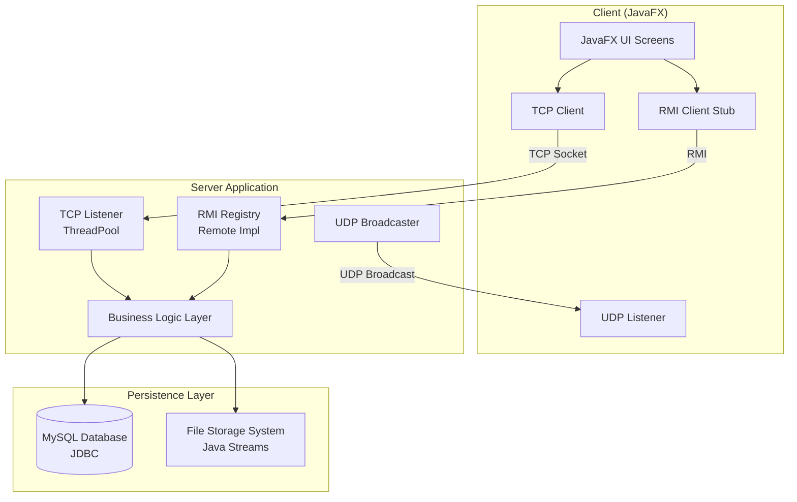
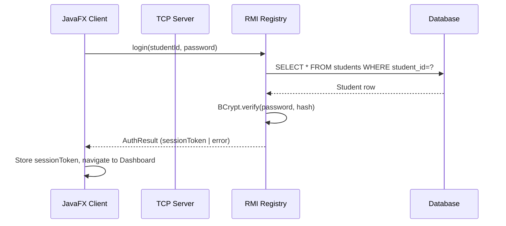
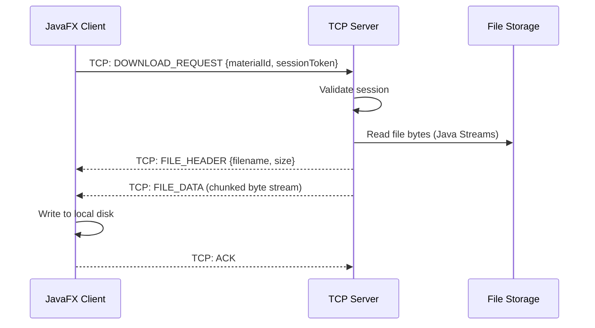
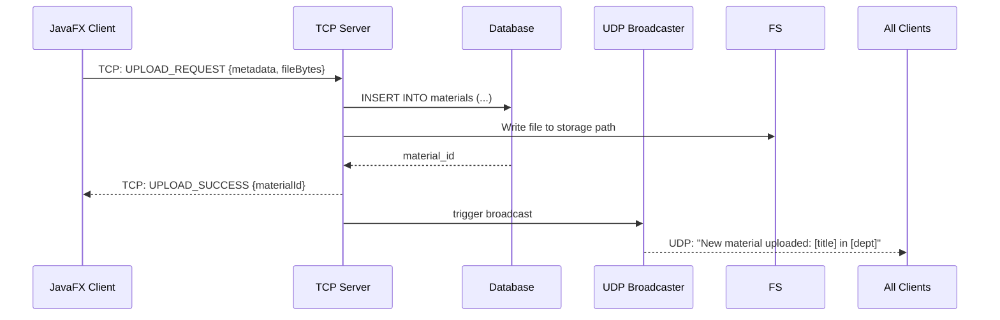

# Design Document: Distributed University Student Learning Material Sharing System

## Overview

A Java-based distributed client-server application that enables university students to access, share, and manage academic learning materials organized by department and academic year. The system uses JavaFX for the client UI, TCP/UDP for networking, RMI for remote service invocation, JDBC for database access, and multithreading to handle concurrent users.

The architecture follows a classic client-server model where a multithreaded server exposes both a TCP socket interface and RMI endpoints, while UDP is used for broadcast announcements. Students authenticate with university credentials, then navigate a hierarchy (Academic Level → Department → Year) to reach a material dashboard where they can search, download, and upload resources.

---

## Architecture



---

## Sequence Diagrams

### Login Flow



### Material Download Flow



### Upload + UDP Announcement Flow



---

## Components and Interfaces

### Component 1: Authentication Module

**Purpose**: Validates student credentials and manages session tokens.

**Interface**:
```java
public interface AuthService extends Remote {
    AuthResult login(String studentId, String password) throws RemoteException;
    boolean validateSession(String sessionToken) throws RemoteException;
    void logout(String sessionToken) throws RemoteException;
}
```

**Responsibilities**:
- Verify student ID and password against the database using BCrypt
- Issue and store session tokens with expiry
- Invalidate sessions on logout or timeout

---

### Component 2: Material Management Module

**Purpose**: Handles search, retrieval, upload, and download of learning materials.

**Interface**:
```java
public interface MaterialService extends Remote {
    List<Material> getMaterials(String department, int year) throws RemoteException;
    List<Material> searchMaterial(String keyword) throws RemoteException;
    UploadResult uploadMaterial(MaterialMetadata metadata, byte[] fileData) throws RemoteException;
    byte[] downloadMaterial(int materialId) throws RemoteException;
}
```

**Responsibilities**:
- Query materials filtered by department and year
- Full-text keyword search across title and course fields
- Store uploaded file bytes to the file system and metadata to the database
- Stream file bytes back to the requesting client

---

### Component 3: TCP Server (Networking Module)

**Purpose**: Accepts client TCP connections and dispatches each to a dedicated handler thread.

**Interface**:
```java
public class TCPServer {
    public void start(int port) throws IOException;
    public void stop();
}

public class ClientHandler implements Runnable {
    public ClientHandler(Socket clientSocket, BusinessLogic logic);
    public void run(); // reads request, dispatches, writes response
}
```

**Responsibilities**:
- Accept connections on a configured port
- Spawn one `ClientHandler` thread per connection
- Parse request type (LOGIN, SEARCH, DOWNLOAD, UPLOAD) and delegate to business logic
- Handle chunked binary transfer for file upload/download

---

### Component 4: UDP Broadcaster

**Purpose**: Sends broadcast announcements to all connected clients when new materials are uploaded.

**Interface**:
```java
public class UDPBroadcaster {
    public void broadcast(String message, int port) throws IOException;
}

public class UDPListener implements Runnable {
    public UDPListener(int port, NotificationHandler handler);
    public void run(); // blocks on DatagramSocket.receive()
}
```

**Responsibilities**:
- Server-side: send `DatagramPacket` to broadcast address after successful upload
- Client-side: listen on a fixed UDP port and push notifications to the UI

---

### Component 5: RMI Module

**Purpose**: Exposes remote methods for authentication and material access over RMI.

**Interface**:
```java
public interface UniversityRMIService extends Remote {
    AuthResult login(String studentId, String password) throws RemoteException;
    List<Material> getMaterials(String department, int year) throws RemoteException;
    List<Material> searchMaterial(String keyword) throws RemoteException;
    UploadResult uploadMaterial(MaterialMetadata metadata) throws RemoteException;
}
```

**Responsibilities**:
- Register implementation in the RMI registry at server startup
- Delegate calls to the shared business logic layer
- Handle `RemoteException` propagation to clients

---

### Component 6: JavaFX UI Module

**Purpose**: Provides all client-facing screens and wires UI events to network calls.

**Screens**:
- `LoginScreen` — student ID + password form
- `DashboardScreen` — academic level selection (Freshman / Pre-Engineering)
- `DepartmentScreen` — department list per level
- `YearScreen` — year selection (2nd, 3rd, 4th, GC)
- `MaterialScreen` — material list, search bar, download button
- `UploadScreen` — file picker + metadata form
- `NotificationPanel` — live UDP announcement feed

---

## Data Models

### Student

```java
public class Student {
    private String studentId;   // PK, university-issued ID
    private String name;
    private String passwordHash; // BCrypt hash
    private String department;
    private int year;
}
```

**Validation Rules**:
- `studentId` must be non-null and match the university ID format
- `passwordHash` must never be stored as plaintext
- `year` must be in {1, 2, 3, 4}

---

### Material

```java
public class Material {
    private int materialId;      // PK, auto-increment
    private String title;
    private String course;
    private String department;
    private int year;
    private String filePath;     // server-side absolute path
    private String uploadedBy;   // student_id FK
    private LocalDateTime uploadedAt;
}
```

**Validation Rules**:
- `title` and `course` must be non-empty strings
- `filePath` must point to an existing file at time of retrieval
- `department` must be one of the known department enum values

---

### MaterialMetadata (transfer object)

```java
public class MaterialMetadata implements Serializable {
    private String title;
    private String course;
    private String department;
    private int year;
    private String filename;
    private String uploaderStudentId;
}
```

---

### AuthResult (transfer object)

```java
public class AuthResult implements Serializable {
    private boolean success;
    private String sessionToken;  // UUID, null on failure
    private String errorMessage;  // null on success
    private Student student;      // null on failure
}
```

---

### Announcement

```java
public class Announcement {
    private int id;
    private String message;
    private LocalDateTime date;
}
```

---

## Database Schema

```sql
CREATE TABLE students (
    student_id   VARCHAR(20)  PRIMARY KEY,
    name         VARCHAR(100) NOT NULL,
    password     VARCHAR(255) NOT NULL,  -- BCrypt hash
    department   VARCHAR(100),
    year         INT
);

CREATE TABLE materials (
    material_id  INT          PRIMARY KEY AUTO_INCREMENT,
    title        VARCHAR(200) NOT NULL,
    course       VARCHAR(100) NOT NULL,
    department   VARCHAR(100) NOT NULL,
    year         INT          NOT NULL,
    file_path    VARCHAR(500) NOT NULL,
    uploaded_by  VARCHAR(20)  REFERENCES students(student_id),
    uploaded_at  TIMESTAMP    DEFAULT CURRENT_TIMESTAMP
);

CREATE TABLE announcements (
    id           INT          PRIMARY KEY AUTO_INCREMENT,
    message      VARCHAR(500) NOT NULL,
    date         TIMESTAMP    DEFAULT CURRENT_TIMESTAMP
);
```

---

## Low-Level Design: Key Algorithms with Formal Specifications

### Algorithm 1: Student Authentication

```java
/**
 * Preconditions:
 *   - studentId != null && !studentId.isBlank()
 *   - password != null && !password.isBlank()
 *   - Database connection is available
 *
 * Postconditions:
 *   - If student exists and password matches:
 *       result.success == true
 *       result.sessionToken is a valid UUID stored in session store
 *       result.student is populated
 *   - If student not found or password mismatch:
 *       result.success == false
 *       result.errorMessage is non-null descriptive string
 *       result.sessionToken == null
 *   - No plaintext password is ever logged or stored
 */
public AuthResult login(String studentId, String password) throws RemoteException {
    Student student = studentDao.findById(studentId);
    if (student == null) {
        return AuthResult.failure("Student not found");
    }
    if (!BCrypt.checkpw(password, student.getPasswordHash())) {
        return AuthResult.failure("Invalid credentials");
    }
    String token = UUID.randomUUID().toString();
    sessionStore.put(token, student);
    return AuthResult.success(token, student);
}
```

---

### Algorithm 2: Material Search

```java
/**
 * Preconditions:
 *   - keyword != null (empty string returns all materials)
 *   - Database connection is available
 *
 * Postconditions:
 *   - Returns a non-null List<Material> (may be empty)
 *   - Every returned material has title or course containing keyword (case-insensitive)
 *   - List is ordered by uploadedAt DESC
 *
 * Loop Invariant:
 *   - All materials added to result so far satisfy the keyword filter
 */
public List<Material> searchMaterial(String keyword) throws RemoteException {
    String sql = "SELECT * FROM materials " +
                 "WHERE LOWER(title) LIKE ? OR LOWER(course) LIKE ? " +
                 "ORDER BY uploaded_at DESC";
    String pattern = "%" + keyword.toLowerCase() + "%";
    return materialDao.query(sql, pattern, pattern);
}
```

---

### Algorithm 3: File Upload (TCP + Streams)

```java
/**
 * Preconditions:
 *   - metadata is non-null and all fields are valid
 *   - fileData is non-null and non-empty byte array
 *   - sessionToken is valid (caller must validate before invoking)
 *   - File storage directory exists and is writable
 *
 * Postconditions:
 *   - File is written to storage path: {storageRoot}/{department}/{year}/{filename}
 *   - A new row is inserted into materials table
 *   - result.materialId > 0
 *   - UDP broadcast is triggered with upload announcement
 *   - If any step fails, no partial state is committed (rollback)
 *
 * Loop Invariant (chunked write):
 *   - bytesWritten <= fileData.length at all times during write loop
 */
public UploadResult uploadMaterial(MaterialMetadata metadata, byte[] fileData) {
    Path storagePath = buildStoragePath(metadata);
    try {
        Files.createDirectories(storagePath.getParent());
        Files.write(storagePath, fileData);
        int materialId = materialDao.insert(metadata, storagePath.toString());
        broadcaster.broadcast("New material: " + metadata.getTitle()
            + " in " + metadata.getDepartment(), UDP_PORT);
        return UploadResult.success(materialId);
    } catch (IOException e) {
        Files.deleteIfExists(storagePath); // rollback file
        return UploadResult.failure(e.getMessage());
    }
}
```

---

### Algorithm 4: TCP Client Handler (per-connection thread)

```java
/**
 * Preconditions:
 *   - clientSocket is open and connected
 *   - businessLogic is fully initialized
 *
 * Postconditions:
 *   - All requests from this client are processed until socket closes
 *   - Socket is closed and resources released when run() returns
 *   - Exceptions do not propagate to the thread pool (caught internally)
 *
 * Loop Invariant:
 *   - clientSocket remains open while the loop continues
 *   - Each iteration processes exactly one complete request-response cycle
 */
@Override
public void run() {
    try (ObjectInputStream in  = new ObjectInputStream(clientSocket.getInputStream());
         ObjectOutputStream out = new ObjectOutputStream(clientSocket.getOutputStream())) {
        while (!clientSocket.isClosed()) {
            Request request = (Request) in.readObject();
            Response response = businessLogic.handle(request);
            out.writeObject(response);
            out.flush();
        }
    } catch (EOFException e) {
        // client disconnected cleanly
    } catch (IOException | ClassNotFoundException e) {
        logger.warn("Client handler error: " + e.getMessage());
    } finally {
        closeQuietly(clientSocket);
    }
}
```

---

### Algorithm 5: Server Startup Sequence

```java
/**
 * Preconditions:
 *   - config contains valid port numbers and DB credentials
 *   - Database is reachable
 *
 * Postconditions:
 *   - TCP server is accepting connections on config.tcpPort
 *   - RMI registry is running on config.rmiPort with service bound
 *   - UDP broadcaster is initialized
 *   - Thread pool is active with config.maxThreads capacity
 */
public void start(ServerConfig config) throws Exception {
    // 1. Initialize DB connection pool
    DataSource ds = DatabasePool.init(config.getDbUrl(),
                                      config.getDbUser(),
                                      config.getDbPassword());

    // 2. Build business logic layer
    BusinessLogic logic = new BusinessLogic(ds, config.getStorageRoot());

    // 3. Start RMI registry and bind service
    Registry registry = LocateRegistry.createRegistry(config.getRmiPort());
    UniversityRMIService rmiImpl = new UniversityRMIServiceImpl(logic);
    registry.bind("UniversityService", UnicastRemoteObject.exportObject(rmiImpl, 0));

    // 4. Start TCP server with thread pool
    ExecutorService pool = Executors.newFixedThreadPool(config.getMaxThreads());
    ServerSocket serverSocket = new ServerSocket(config.getTcpPort());
    while (true) {
        Socket client = serverSocket.accept();
        pool.submit(new ClientHandler(client, logic));
    }
}
```

---

## Example Usage

### Client: Login via RMI

```java
Registry registry = LocateRegistry.getRegistry("server-host", 1099);
UniversityRMIService service =
    (UniversityRMIService) registry.lookup("UniversityService");

AuthResult result = service.login("STU-2024-001", "mypassword");
if (result.isSuccess()) {
    SessionContext.set(result.getSessionToken(), result.getStudent());
    Platform.runLater(() -> navigator.goTo(Screen.DASHBOARD));
} else {
    showError(result.getErrorMessage());
}
```

### Client: Fetch and Display Materials

```java
List<Material> materials = service.getMaterials("Software Engineering", 2);
ObservableList<Material> items = FXCollections.observableArrayList(materials);
materialTableView.setItems(items);
```

### Client: UDP Notification Listener (background thread)

```java
UDPListener listener = new UDPListener(9090, message ->
    Platform.runLater(() -> notificationPanel.addNotification(message))
);
Thread udpThread = new Thread(listener);
udpThread.setDaemon(true);
udpThread.start();
```

---

## Correctness Properties

*A property is a characteristic or behavior that should hold true across all valid executions of a system — essentially, a formal statement about what the system should do. Properties serve as the bridge between human-readable specifications and machine-verifiable correctness guarantees.*

### Property 1: Login result correctness

*For any* student ID and password pair: if the student exists in the database and the password matches the stored BCrypt hash, `login` returns an AuthResult with `success == true`, a non-null UUID v4 session token, and the populated Student object; otherwise `login` returns `success == false` with a non-null error message and a null session token.

**Validates: Requirements 1.1, 1.2, 1.3**

---

### Property 2: Login–validateSession round trip

*For any* valid student credentials, calling `login` followed immediately by `validateSession` with the returned token must return `true`; calling `validateSession` with any string not returned by a successful `login` must return `false`.

**Validates: Requirements 1.4, 2.1**

---

### Property 3: Logout invalidates session

*For any* active session token, calling `logout` followed by `validateSession` with that same token must return `false`.

**Validates: Requirements 2.2**

---

### Property 4: Invalid session token rejection

*For any* string that is not a currently valid session token in the SessionStore, a TCP request carrying that token must receive an error response and the request must not be processed.

**Validates: Requirements 2.4**

---

### Property 5: getMaterials filter correctness

*For any* department string and year integer, every Material in the list returned by `getMaterials(department, year)` must have `material.getDepartment().equals(department)` and `material.getYear() == year`.

**Validates: Requirements 3.1**

---

### Property 6: searchMaterial filter correctness

*For any* non-empty keyword string, every Material in the list returned by `searchMaterial(keyword)` must satisfy `title.toLowerCase().contains(keyword.toLowerCase()) || course.toLowerCase().contains(keyword.toLowerCase())`.

**Validates: Requirements 4.1**

---

### Property 7: Search results ordering

*For any* keyword, the list returned by `searchMaterial(keyword)` must be ordered such that for every consecutive pair `(m_i, m_{i+1})`, `m_i.getUploadedAt()` is greater than or equal to `m_{i+1}.getUploadedAt()`.

**Validates: Requirements 4.3**

---

### Property 8: Upload–getMaterials round trip

*For any* valid MaterialMetadata and non-empty file bytes, if `uploadMaterial` returns `success == true`, then a subsequent call to `getMaterials(metadata.getDepartment(), metadata.getYear())` must include a Material whose title and course match the uploaded metadata.

**Validates: Requirements 5.1**

---

### Property 9: Upload atomicity on failure

*For any* upload attempt where either the file write or the database insert fails, no file must remain at the computed storage path and no row with the corresponding title/uploader/timestamp must exist in the `materials` table after the operation completes.

**Validates: Requirements 5.3, 5.4**

---

### Property 10: Concurrent upload uniqueness

*For any* two simultaneous upload requests with identical filenames, department, and year, both must succeed and the two resulting storage paths must be distinct (i.e., the server appends a UUID suffix to avoid collision).

**Validates: Requirements 5.5**

---

### Property 11: Download round trip

*For any* material that has been successfully uploaded, downloading it via a `DOWNLOAD_REQUEST` must return byte content that is identical to the original uploaded bytes.

**Validates: Requirements 6.1**

---

### Property 12: ClientHandler socket lifecycle

*For any* ClientHandler execution — whether it completes normally, encounters an EOF, or throws an unexpected exception — the client socket must be closed when `run()` returns, and an error in one handler must not affect other concurrently running handlers.

**Validates: Requirements 7.4, 7.5**

---

### Property 13: UDP listener callback delivery

*For any* UDP datagram sent to the configured broadcast port, the UDPListener must invoke the registered NotificationHandler callback with the exact message string contained in the datagram.

**Validates: Requirements 9.2**

---

### Property 14: UDP broadcast message safety

*For any* successful upload, the UDP broadcast message must contain only the material title and department, and must not contain any session token, password, file path, or student ID.

**Validates: Requirements 9.5, 13.6**

---

### Property 15: JDBC failure produces ServiceException

*For any* DAO operation where the underlying JDBC call throws a `SQLException`, the DAO must throw a `ServiceException` wrapping that `SQLException`, and the server must return an error response to the client rather than propagating an unhandled exception.

**Validates: Requirements 12.5**

---

### Property 16: BCrypt hash cost factor

*For any* student record stored in the database, the `password` column value must be a valid BCrypt hash string whose embedded cost factor is greater than or equal to 10.

**Validates: Requirements 13.1**

---

### Property 17: Filename sanitization prevents path traversal

*For any* client-supplied filename containing `..`, `/`, or `\` characters, the sanitized filename used to construct the storage path must not contain any of those characters, and the resulting absolute path must remain within the StorageRoot directory.

**Validates: Requirements 13.4**

---

### Property 18: Storage path construction

*For any* valid MaterialMetadata, the storage path computed by the server must equal `{storageRoot}/{department}/{year}/{sanitizedFilename}` (after sanitization and UUID-suffix deduplication if needed).

**Validates: Requirements 14.1**

---

## Error Handling

### Scenario 1: Invalid Credentials

**Condition**: Student ID not found or password hash mismatch  
**Response**: Return `AuthResult.failure("Invalid credentials")` — do not distinguish between "not found" and "wrong password" to prevent user enumeration  
**Recovery**: Client shows error message; user may retry

### Scenario 2: Database Unavailable

**Condition**: JDBC connection fails during any DAO operation  
**Response**: Throw `ServiceException` wrapping the `SQLException`; server returns error response to client  
**Recovery**: Connection pool retries up to 3 times with exponential backoff; client shows "Service temporarily unavailable"

### Scenario 3: File Not Found on Download

**Condition**: `file_path` in DB points to a missing file  
**Response**: Server returns `DownloadResult.failure("File not available")`  
**Recovery**: Admin is notified via log; client shows error and suggests contacting support

### Scenario 4: Concurrent Upload Conflict

**Condition**: Two clients upload a file with the same name to the same department/year simultaneously  
**Response**: Storage path includes a UUID suffix to guarantee uniqueness; no conflict possible  
**Recovery**: Both uploads succeed independently

### Scenario 5: RMI Connection Failure

**Condition**: Client cannot reach RMI registry  
**Response**: `RemoteException` caught in client; fallback to TCP socket-based request  
**Recovery**: Client retries RMI lookup after 5 seconds; shows "Connecting..." indicator

---

## Testing Strategy

### Unit Testing

- `AuthServiceImpl.login()`: test correct credentials, wrong password, unknown student ID, null inputs
- `MaterialServiceImpl.searchMaterial()`: test exact match, partial match, empty keyword, no results
- `MaterialServiceImpl.uploadMaterial()`: test successful upload, I/O failure rollback, DB failure rollback
- `ClientHandler.run()`: test clean disconnect (EOFException), malformed request, valid request cycle

### Property-Based Testing

**Library**: `junit-quickcheck` (Java property-based testing)

- For any non-null `keyword`, `searchMaterial(keyword)` returns a list where every element satisfies the filter predicate
- For any valid `(department, year)` pair, `getMaterials(department, year)` returns only materials matching both fields
- For any `studentId` not in the database, `login(studentId, anyPassword)` always returns `success == false`
- `uploadMaterial` followed by `getMaterials` for the same department/year always includes the newly uploaded material

### Integration Testing

- Full login → navigate → download flow using an in-memory H2 database
- TCP client-server round trip: send `SEARCH` request, verify response matches DB state
- UDP broadcast: trigger upload, verify all registered `UDPListener` instances receive the announcement within 500ms

---

## Performance Considerations

- Thread pool size should be tuned to `min(32, availableProcessors + 4)` as a starting point (following `ForkJoinPool` heuristics for I/O-bound tasks)
- File downloads are streamed in 8KB chunks rather than loading entire files into memory
- Material search queries use `LIKE` with indexed columns; for larger datasets, consider adding a full-text index (`FULLTEXT` in MySQL) on `title` and `course`
- Session store uses `ConcurrentHashMap` for thread-safe access without locking overhead
- RMI calls for large file transfers should be avoided; use TCP streaming instead and reserve RMI for metadata operations

---

## Security Considerations

- Passwords are stored as BCrypt hashes (cost factor ≥ 10); plaintext passwords are never logged
- Session tokens are UUID v4 (128-bit random); stored server-side with expiry (e.g., 2 hours of inactivity)
- All SQL queries use `PreparedStatement` with parameterized inputs to prevent SQL injection
- File paths are constructed server-side from validated metadata; client-supplied filenames are sanitized (strip `..`, `/`, `\`) to prevent path traversal
- Upload access is restricted to authenticated users; admin-only upload can be enforced via a `role` column in the `students` table
- UDP broadcasts contain no sensitive data (only material title and department)

---

## Dependencies

| Dependency | Purpose |
|---|---|
| JavaFX 17+ | Client UI framework |
| JDBC (MySQL Connector/J 8.x) | Database access |
| BCrypt (`jBCrypt` or Spring Security Crypto) | Password hashing |
| Java RMI (built-in) | Remote method invocation |
| Java Sockets (built-in) | TCP/UDP networking |
| Java NIO / `java.nio.file` | File I/O streaming |
| `java.util.concurrent` | Thread pool management |
| JUnit 5 + `junit-quickcheck` | Unit and property-based testing |
| H2 Database | In-memory DB for integration tests |
